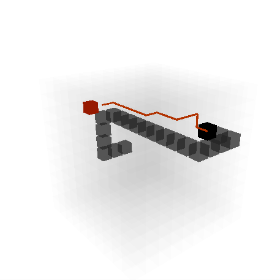
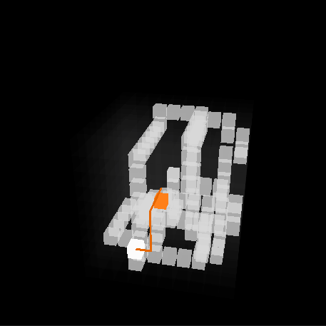

# snAI-k 3D (Snake 3D AI pathfinding)

[](https://opensource.org/licenses/MIT)
[](https://en.cppreference.com/w/cpp/20)
[](https://www.opengl.org/)
[](https://github.com/libsdl-org/SDL)
[](https://github.com/g-truc/glm)
[](https://github.com/Dav1dde/glad)

## Overview
This project implements a classic Snake game prototype that features AI pathfinding algorithms, SDL3 for window and input, OpenGL for rendering, ImGui for GUI controls, and a dynamic synth sound generation.

🎮 **Test snAI-k on itch.io!**  
[snAI-k on itch.io](https://guillem-serra.itch.io/snai-k)



## Features

- AI Pathfinding: Implements an AI-controlled snake using A* pathfinding to navigate towards targets.
- Rendering: Real-time rendering using OpenGL with SDL3 window management.
- Audio: Custom audio synthesizer based on snake behavior and environment, supporting audio mixing.
- User Interface: integrated ImGui for a simple HUD.

## Dependencies
- OpenGL 3
- SDL 3
- glm 1
- glad 0.1



## Building

This project uses CMake and relies on vcpkg for dependency management.
You also need to manually clone Dear ImGui into third_party/imgui directory.

Generic build commands:
```bash
mkdir build
cd build
cmake ..
cmake --build .
```

Building with vcpkg on Windows (Visual Studio 2022)
```bash
cmake -B build/native -S . ^
-DCMAKE_TOOLCHAIN_FILE=F:/path/to/vcpkg/scripts/buildsystems/vcpkg.cmake ^
-DVCPKG_TARGET_TRIPLET=x64-windows ^
-G "Visual Studio 17 2022" -A x64

cmake --build build/native --config Release
```

# Documentation:

#### SDL3 examples
https://examples.libsdl.org/SDL3/demo/01-snake/  
https://examples.libsdl.org/SDL3/demo/02-woodeneye-008/  
https://examples.libsdl.org/SDL3/audio/02-simple-playback-callback/

#### OpenGL
https://learnopengl.com/

#### A* pathfinding algorithm
https://www.redblobgames.com/pathfinding/a-star/introduction.html

## License

This project is open source and available under the MIT License.